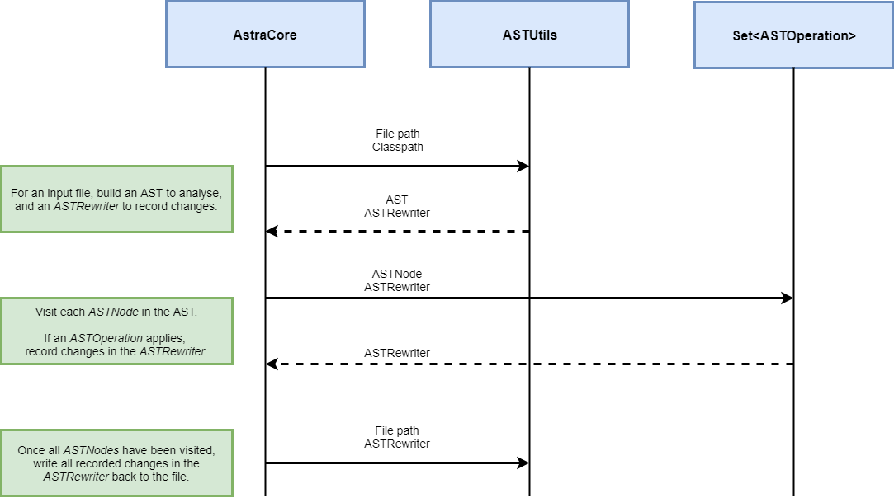

## What is Astra?
**Astra** is a tool for analysing and refactoring Java source code, using Java language constructs. 

For example:

* "_References to type A should instead reference type B_"
* "_Callers of method A should add an additional argument B_"
* "_Find classes which are annotated with A_"

Astra has been developed and tested at Alfa to improve the velocity at which large scale refactors may be performed.

## How do I use Astra?
* Astra can be run as part of a Java application, using `astra-core` as a dependency and using the refactors it provides. For an illustration of how to do this, please see the [README in astra-core](./astra-core/README.md). The code can be found in [astra-example](./astra-example).
* For cases needing a more bespoke approach, [astra-core](./astra-core/README.md) also provides an SPI for writing your own custom `ASTOperation`s. See the `astra-core` README for further details.
* For very simple cases, there is also a command line interface which exposes a small subset of Astra's refactoring operations. Please see [astra-cli](./astra-cli/README.md) for more information.

## Why would I use Astra?
A simple and common use case is renaming a method, and updating all the callers of that method so that they use the new name. 
Your IDE is often the best tool for the job, but sometimes this isn't possible. There may be so many modules that manually selecting and opening them is a real pain, or the overall size of the modules may mean that your IDE struggles to open them all at once. 
This means that sometimes it's easier to just add a new method, deprecate the old one, and leave all the existing callers. 
The same issues apply to many other refactors, such as renaming a type. 

Astra can be used to make changes like these easily, and on a massive scale.

## How does Astra work?
Astra compiles source code into an [AST](https://en.wikipedia.org/wiki/Abstract_syntax_tree), a construct that gives the tool useful information about the structure of the code. Astra then allows you to analyse or refactor your source code based on information from the AST.

Here's a sequence diagram explaining how it works:

`AstraCore` iterates through all the Java source files in the input directory. 
File-by-file, an AST is compiled - from the source file, plus any additional classpaths supplied. 
Each individual construct, such as a name, type, expression, statement, or declaration, is represented in this AST by an `ASTNode`.
It also builds an `ASTRewriter`, to record any changes to be made to the AST. 

Astra then visits every `ASTNode` in the AST, passing every node through a set of `ASTOperations`. If an operation is applicable to that node, (e.g. is this an invocation of method A?) the `ASTOperation` records relevant changes in the `ASTRewriter` (e.g. invoke method B instead)

When all `ASTNodes` in a source file's AST have been visited, any changes recorded in the `ASTRewriter` are written back to the original source file. At this stage, Astra will also organise imports in a similar way to an IDE, removing duplicates and unused imports, and sorting.

## Technologies
* Java 8
* Eclipse JDT
* JUnit
* log4j
